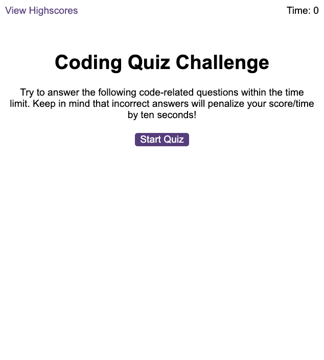
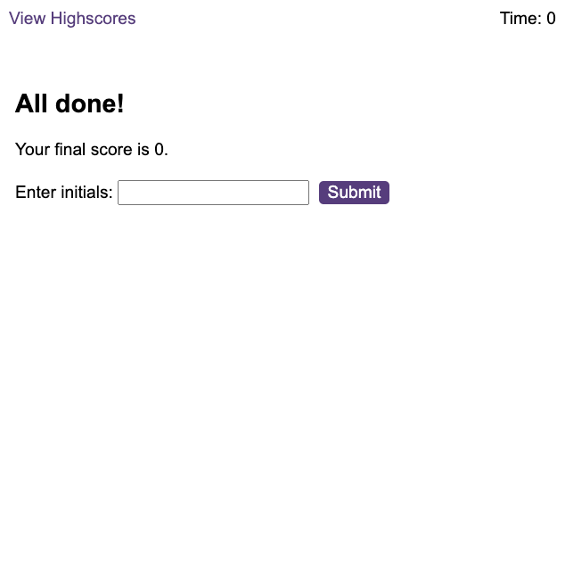
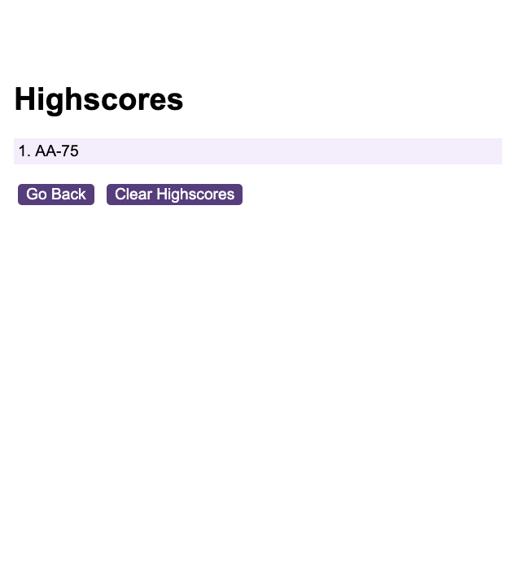

<
<!-- PROJECT LOGO -->
 

  <h1 align="center">Code Quiz</h1>

  

    This coding assessment is a combination of multiple-choice questions and interactive coding challenges. 
     
   

<!-- ABOUT THE PROJECT -->
## About The Project

As you proceed in your journey to becoming a front-end web developer, it’s likely that you’ll be asked to complete a coding assessment, perhaps as part of an interview process. A typical coding assessment is a combination of multiple-choice questions and interactive coding challenges. 

Here's why:
To help you become familiar with these tests this quiz invites you to take this timed coding quiz with multiple-choice questions. 
 
Use this link[https://asherbeck10.github.io/Code-Quiz/] to get started.

### Built With
This app  run in the browser, feature dynamically updated HTML (DOM),JSON and CSS powered by JavaScript code.

<!-- USAGE EXAMPLES -->
## Usage
1. Click on the "start Quiz" button  in the start page it will take you to the multiple-choice view.

2. choose one of the four answers by clicking on the answer button.a timer will run at the right upper corner.
3. When answer is clicked, the next question appears.
4. If the answer clicked was incorrect then subtract time from the clock.
5. The quiz ends when all questions are answered or the timer reaches 0.
6. When the game ends, it would display their score and give the user the ability to save their initials and their score.
 

7. You can see the  high score on the "highscores" page. 

<!-- ACKNOWLEDGMENTS -->
## Acknowledgments

* (https://developer.mozilla.org/en-US/)
* (https://www.w3schools.com/js/default.asp)

